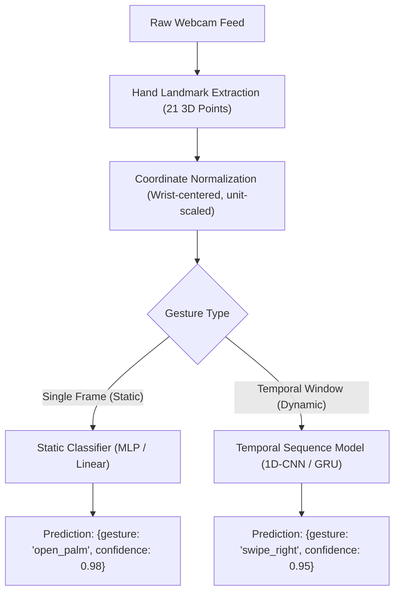

# Personalized Vision Gesture Recognition & Training Guide for Stewart

This technical document is a blueprint for collecting personal gesture data and training a high-precision, low-latency **vision gesture recognition model** tailored specifically to your hand geometry, camera angle, and personal movement habits on NixOS.

---

## 1. Core Philosophy: Why Personalized Landmark Training?

Generic off-the-shelf gesture models struggle because they try to accommodate all hands, lighting conditions, and camera angles at once. 

By training directly on **how you personally perform gestures**:
* **>99% Recognition Precision**: Trained directly on your physical style and camera field of view.
* **Lighting & Room Invariance**: Hand landmarks ($x, y, z$ coordinates) are extracted first; lighting, clothing, and background changes do not distort the structural hand geometry.
* **Distance & Position Invariance**: Geometric normalization ensures a gesture is recognized whether your hand is close to the lens or further back.
* **Ultra-Fast & Lightweight**: 
  - Feature extraction: ~60 FPS on CPU via MediaPipe Hands or YOLO-Pose.
  - Classifier inference: **< 1 millisecond**.
  - Total model size: **< 200 KB** (no GPU memory footprint, leaving VRAM entirely free for LLMs/TTS).

---

## 2. Gesture Categories: Static vs. Dynamic

A complete gesture recognition system differentiates between two types of gestures:



### A. Static Gestures (Evaluated Per Frame)
Position/shape of fingers held at any moment:
* `open_palm` — all 5 fingers fully extended and spread.
* `closed_fist` — all fingers curled into the palm.
* `thumbs_up` / `thumbs_down` — thumb extended vertically, other fingers curled.
* `pointing` — index finger extended, other fingers curled.
* `peace_sign` — index and middle fingers extended in a V-shape.
* `ok_sign` — thumb and index finger touching tips in a loop, other fingers extended.
* `pinch` — thumb and index finger tips touching.

### B. Dynamic Gestures (Evaluated Over a Sliding Time Window)
Movement trajectories over 10–25 consecutive frames (~0.3 to 0.7 seconds):
* `swipe_left` — hand moving rapidly across the camera frame to the left.
* `swipe_right` — hand moving rapidly to the right.
* `swipe_up` / `swipe_down` — vertical hand swipe.
* `wave` — palm swaying left-to-right repeatedly.
* `push_forward` — palm moving toward the camera lens.

---

## 3. Coordinate Normalization Algorithm

Raw camera coordinates $(x_i, y_i, z_i)$ vary as you move around the camera frame. We make them translation-invariant and scale-invariant before feeding into any classifier:

```python
import numpy as np

def normalize_hand_landmarks(landmarks_21x3: np.ndarray) -> np.ndarray:
    """
    Translates hand coordinates so landmark 0 (wrist) is at (0, 0, 0),
    and scales all coordinates by the maximum Euclidean distance to make
    the vector distance-invariant.
    
    Input: np.ndarray of shape (21, 3)
    Output: np.ndarray of shape (63,) with normalized coordinates in [-1.0, 1.0]
    """
    coords = np.array(landmarks_21x3, dtype=np.float32)  # (21, 3)
    
    # 1. Translation invariance: center at wrist (landmark 0)
    wrist = coords[0]
    translated = coords - wrist
    
    # 2. Scale invariance: normalize by maximum distance from wrist to any joint
    distances = np.linalg.norm(translated, axis=1)
    max_dist = np.max(distances)
    if max_dist > 1e-6:
        normalized = translated / max_dist
    else:
        normalized = translated
        
    return normalized.flatten()  # 63 features
```

---

## 4. Step 1: Personalized Data Collection (`scripts/vision/record_gestures.py`)

Capture 60–100 samples per gesture class. Hold the gesture for ~5 seconds while gently tilting or shifting your hand angle to provide realistic variation:

```python
#!/usr/bin/env python3
import cv2
import json
import time
import argparse
from pathlib import Path
import mediapipe as mp
import numpy as np

mp_hands = mp.solutions.hands

def capture_static_gesture(label: str, target_samples: int = 100, output_path: str = "data/dataset/gestures_static.jsonl"):
    Path(output_path).parent.mkdir(parents=True, exist_ok=True)
    cap = cv2.VideoCapture(0)
    hands = mp_hands.Hands(max_num_hands=1, min_detection_confidence=0.7)
    
    print(f"\n--> Prepare your gesture: '{label}'")
    print("--> Press SPACE when ready to begin recording...")
    
    while True:
        ret, frame = cap.read()
        if not ret:
            continue
        cv2.putText(frame, f"Gesture: {label}. Press SPACE to record", (20, 40),
                    cv2.FONT_HERSHEY_SIMPLEX, 0.7, (0, 255, 0), 2)
        cv2.imshow("Capture Gestures", frame)
        if cv2.waitKey(1) & 0xFF == ord(' '):
            break
            
    samples = []
    print(f"Recording {target_samples} frames for '{label}'... (gently tilt/rotate hand)")
    
    while len(samples) < target_samples:
        ret, frame = cap.read()
        if not ret:
            continue
        
        rgb = cv2.cvtColor(frame, cv2.COLOR_BGR2RGB)
        result = hands.process(rgb)
        
        if result.multi_hand_landmarks:
            raw_pts = [[lm.x, lm.y, lm.z] for lm in result.multi_hand_landmarks[0].landmark]
            features = normalize_hand_landmarks(np.array(raw_pts)).tolist()
            samples.append({"label": label, "features": features})
            
            cv2.putText(frame, f"Recording: {len(samples)}/{target_samples}", (20, 40),
                        cv2.FONT_HERSHEY_SIMPLEX, 0.8, (0, 0, 255), 2)
                        
        cv2.imshow("Capture Gestures", frame)
        cv2.waitKey(20)
        
    cap.release()
    cv2.destroyAllWindows()
    
    with open(output_path, "a", encoding="utf-8") as f:
        for s in samples:
            f.write(json.dumps(s) + "\n")
            
    print(f"--> Successfully captured {len(samples)} samples for '{label}' in {output_path}!")


def capture_dynamic_gesture(label: str, target_sequences: int = 40, seq_len: int = 20, output_path: str = "data/dataset/gestures_dynamic.jsonl"):
    """
    Captures temporal gesture sequences (e.g. swipes) across consecutive frames.
    """
    Path(output_path).parent.mkdir(parents=True, exist_ok=True)
    cap = cv2.VideoCapture(0)
    hands = mp_hands.Hands(max_num_hands=1, min_detection_confidence=0.7)
    
    print(f"\n--> Prepare dynamic gesture: '{label}' (e.g. swipe motion)")
    sequences = []
    
    for i in range(target_sequences):
        print(f"Perform swipe {i+1}/{target_sequences}... (press SPACE before each motion)")
        while True:
            ret, frame = cap.read()
            cv2.putText(frame, f"Ready for {label} ({i+1}/{target_sequences}). Press SPACE", (20, 40),
                        cv2.FONT_HERSHEY_SIMPLEX, 0.6, (0, 255, 0), 2)
            cv2.imshow("Capture Gestures", frame)
            if cv2.waitKey(1) & 0xFF == ord(' '):
                break
                
        seq_frames = []
        for _ in range(seq_len):
            ret, frame = cap.read()
            rgb = cv2.cvtColor(frame, cv2.COLOR_BGR2RGB)
            result = hands.process(rgb)
            if result.multi_hand_landmarks:
                raw_pts = [[lm.x, lm.y, lm.z] for lm in result.multi_hand_landmarks[0].landmark]
                seq_frames.append(normalize_hand_landmarks(np.array(raw_pts)).tolist())
            else:
                seq_frames.append([0.0] * 63)
            cv2.waitKey(15)
            
        sequences.append({"label": label, "sequence": seq_frames})
        
    cap.release()
    cv2.destroyAllWindows()
    
    with open(output_path, "a", encoding="utf-8") as f:
        for s in sequences:
            f.write(json.dumps(s) + "\n")
    print(f"--> Saved {len(sequences)} temporal sequences for '{label}'!")
```

---

## 5. Step 2: Training the Classifier Models

### Model A: Static Gesture MLP (Trains in ~3 Seconds)

```python
#!/usr/bin/env python3
import json
import torch
import torch.nn as nn
from torch.utils.data import TensorDataset, DataLoader
from sklearn.model_selection import train_test_split
import numpy as np

class StaticGestureMLP(nn.Module):
    """Compact 2-layer classifier operating on 63 normalized coordinates."""
    def __init__(self, num_classes: int):
        super().__init__()
        self.net = nn.Sequential(
            nn.Linear(63, 128),
            nn.BatchNorm1d(128),
            nn.ReLU(),
            nn.Dropout(0.15),
            nn.Linear(128, 64),
            nn.ReLU(),
            nn.Linear(64, num_classes)
        )
        
    def forward(self, x):
        return self.net(x)

def train_static(dataset_path="data/dataset/gestures_static.jsonl", save_path="data/models/static_gesture_mlp.pt"):
    with open(dataset_path) as f:
        rows = [json.loads(line) for line in f]
        
    labels = sorted(list(set(r["label"] for r in rows)))
    label_to_idx = {l: i for i, l in enumerate(labels)}
    
    X = np.array([r["features"] for r in rows], dtype=np.float32)
    y = np.array([label_to_idx[r["label"]] for r in rows], dtype=np.int64)
    
    X_train, X_val, y_train, y_val = train_test_split(X, y, test_size=0.15, stratify=y, random_state=42)
    
    train_loader = DataLoader(TensorDataset(torch.tensor(X_train), torch.tensor(y_train)), batch_size=32, shuffle=True)
    val_loader = DataLoader(TensorDataset(torch.tensor(X_val), torch.tensor(y_val)), batch_size=32)
    
    model = StaticGestureMLP(num_classes=len(labels))
    optimizer = torch.optim.AdamW(model.parameters(), lr=1e-3, weight_decay=1e-4)
    criterion = nn.CrossEntropyLoss()
    
    for epoch in range(35):
        model.train()
        for bx, by in train_loader:
            optimizer.zero_grad()
            out = model(bx)
            loss = criterion(out, by)
            loss.backward()
            optimizer.step()
            
    # Evaluation
    model.eval()
    correct, total = 0, 0
    with torch.no_grad():
        for bx, by in val_loader:
            preds = model(bx).argmax(dim=-1)
            correct += (preds == by).sum().item()
            total += len(by)
            
    val_acc = (correct / total) * 100
    print(f"Training Complete! Validation Accuracy: {val_acc:.2f}%")
    
    torch.save({
        "state_dict": model.state_dict(),
        "labels": labels,
        "label_to_idx": label_to_idx
    }, save_path)
    print(f"Model saved to {save_path}!")
```

### Model B: Dynamic Gesture 1D-CNN / GRU (For Swipes & Trajectories)

```python
class DynamicGestureGRU(nn.Module):
    """Sequence model processing sliding time windows of (sequence_length x 63)."""
    def __init__(self, num_classes: int, hidden_dim: int = 64, num_layers: int = 1):
        super().__init__()
        self.gru = nn.GRU(input_size=63, hidden_size=hidden_dim, num_layers=num_layers, batch_first=True)
        self.fc = nn.Linear(hidden_dim, num_classes)
        
    def forward(self, x):
        # x shape: (batch_size, seq_len, 63)
        out, _ = self.gru(x)
        last_step = out[:, -1, :]
        return self.fc(last_step)
```

---

## 6. Step 3: Real-Time Prediction & Event Emitter

This class runs continuous real-time inference on camera frames and emits raw recognized gesture events with confidence scores. Any downstream service or command mapping can listen to these events:

```python
import collections
import torch
import numpy as np

class GestureRecognizer:
    def __init__(self, model_path="data/models/static_gesture_mlp.pt"):
        checkpoint = torch.load(model_path, map_location="cpu")
        self.labels = checkpoint["labels"]
        self.model = StaticGestureMLP(len(self.labels))
        self.model.load_state_dict(checkpoint["state_dict"])
        self.model.eval()
        
        self.history = collections.deque(maxlen=5)  # 5-frame rolling majority voting
        self.cooldown_frames = 0

    def predict_frame(self, raw_21x3_landmarks):
        """
        Takes raw 21x3 landmarks from MediaPipe/YOLO-Pose.
        Returns: (gesture_name, confidence) or None if in cooldown or unconfident.
        """
        if self.cooldown_frames > 0:
            self.cooldown_frames -= 1
            return None
            
        features = normalize_hand_landmarks(raw_21x3_landmarks)
        with torch.no_grad():
            logits = self.model(torch.tensor([features], dtype=torch.float32))
            probs = torch.softmax(logits, dim=-1)[0]
            conf, pred_idx = torch.max(probs, dim=0)
            
        label = self.labels[pred_idx] if conf > 0.88 else "background"
        self.history.append(label)
        
        # Debounce: require at least 4 out of 5 consecutive frames to agree
        counts = collections.Counter(self.history)
        most_common, freq = counts.most_common(1)[0]
        
        if most_common != "background" and freq >= 4:
            self.history.clear()
            self.cooldown_frames = 20  # ~0.6s cooldown between discrete gesture events
            return most_common, float(conf)
            
        return None
```

---

## 7. Summary

* **Scope**: Focuses entirely on capturing hand landmarks and training clean classification models for static and dynamic gestures.
* **Separation of Concerns**: Action mappings (which gesture performs what action) remain decoupled and can be configured independently later.
* **Turnaround**: Recording your gesture dataset takes ~5 minutes; model training takes ~3–10 seconds.
