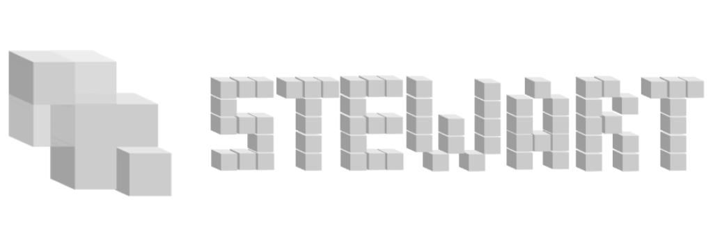

<div align = center>


![Badge Release]
![Badge License]
![Badge Language] 
![Badge Ahh]<br>

[//]: # (Stable: [v1.2.0]&#40;https://github.com/ilyamiro/Stewart/releases/tag/v1.0.0-alpha&#41; / )
<a id="link-wiki" href="https://github.com/ilyamiro/Stewart/wiki">📘Explore the wiki</a>
<br>

**[<kbd> <br> About <br> </kbd>][About]** 
**[<kbd> <br> Roadmap <br> </kbd>][Roadmap]** 
**[<kbd> <br> Install <br> </kbd>][Install]** 
**[<kbd> <br> License <br> </kbd>][License]** 


<br>
</div>

> [!CAUTION]
> The project is in development and is not ready for usage</h3>

## About

Lines of code: **2555** 

A desktop-based voice assistant build with python.

- A **local** vosk STT recognition model 
- **local voice synthesis model** based on SileroTTS with a use of self-contained library [voicesynth](https://github.com/ilyamiro/voicesynth)
- Complex **tree-based** command implementation 
- **Improved but limited** recognition feature available (+99% voice recognition accuracy for commands)
- Fast and efficient command **handling**
- **Linux-based**

### Roadmap

- [ ] Wake word detection
- [ ] Speaker diarization and recognition for vosk speech-to-text
- [ ] GUI written with **flet** (Flutter port for python) / **PyQt5** (PySide6)
- [ ] Improve extensibility (Plugin support) and create API
- [ ] Switch to C++
  - [ ] Write command tree search system in C++
- [ ] Wiki
  - [ ] Command editor
  - [ ] Reference
  - [ ] Plugins/Extensions

## Installation

> [!IMPORTANT]
> Windows 10/11 is not supported at the moment

1. Clone repository and install dependencies:
  ```commandline
  git clone https://github.com/ilyamiro/Stewart.git
  cd Stewart
  python3.11 -m pip install -r requirements.txt
  ```
2. Launch main.py and wait till voice assistant starts:<br>
- **Linux**:
```commandline
python3.11 main.py
```

### License


Copyright - 2024 -  <i>Miroshnichenko Illia</i> ©

Licensed under the Apache License, Version 2.0 (the "License");
you may not use this file except in compliance with the License.

You may obtain a copy of the License at

   http://www.apache.org/licenses/LICENSE-2.0

Unless required by applicable law or agreed to in writing,
software distributed under the License is distributed on an "AS IS" BASIS, WITHOUT WARRANTIES OR CONDITIONS OF ANY KIND, either express or implied.
See the License for the specific language governing permissions and limitations under the License.

<!----------------------------------------------------------------------------->

[About]: #About
[Install]: #Installation
[Roadmap]: #Roadmap
[License]: #License

<!----------------------------------{ Badges }--------------------------------->

[Badge Release]: https://img.shields.io/github/v/release/ilyamiro/Stewart.svg
[Badge Language]: https://img.shields.io/github/languages/top/ilyamiro/Stewart
[Badge License]: https://img.shields.io/github/license/ilyamiro/Stewart
[Badge Ahh]: https://img.shields.io/badge/Pet-project-C68FE6